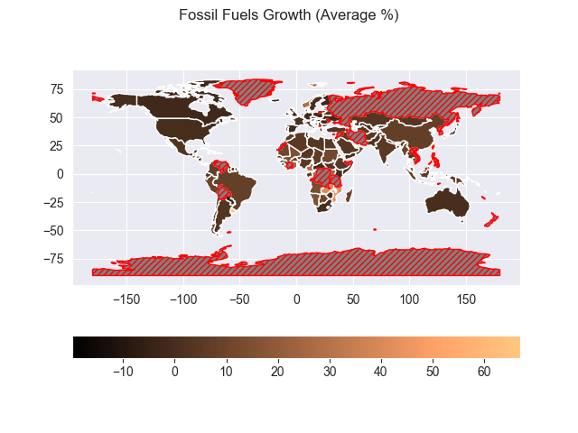
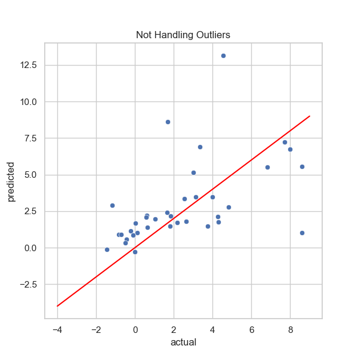
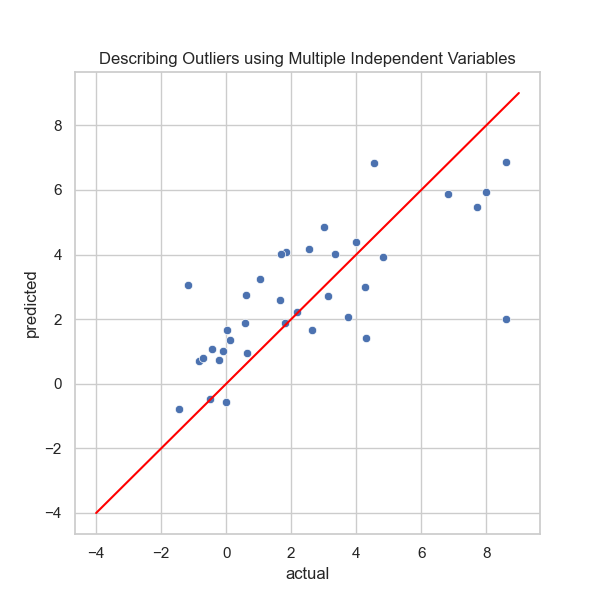
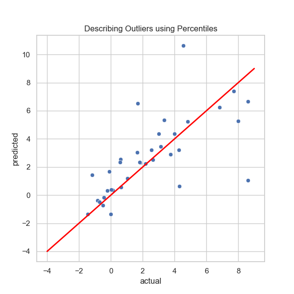

# Sustainable Energy Analysis
This data analysis project focuses on exploring and analyzing the "Global Data on Sustainable Energy (2000-2020)"
dataset, created by Ansh Tanwar and obtained from kaggle.com. 
The Juypter notebook "SustainableEnergyEDA.ipynb" contains my analysis of this dataset, 
my thoughts while exploring it, and some visualizations I created to gain insights into sustainable energy trends over two decades.

## Steps Taken to Perform Exploratory Data Analysis (EDA)
- Renamed columns for consistency.
- Adjusted data types.
- Checked for duplicates (none found).
- Detected and visualized outliers.
- Explored different strategies for handling NaN values.
- Engineered new data columns based on existing data.

- Generated various data visualizations including:
  - Heatmaps and Pairplots to visualize correlations between variables
  - Choropleth Maps of geographic trends, using vector and raster map data from Natural Earth.

## Geography Data
This was my first experience using GeoPandas to create geographic data visualizations.
Natural Earth provides free vector and raster map data, 
and GeoPandas makes it easy to merge dataframes based on geographic data. 
This eliminated the need to merge the dataframes based on contradicting country names.

    
    
    

## Approach for Multiple Linear Regression Analysis
The dataset used for this analysis is relatively small and contains a significant number of outliers. 
These outliers most likely indicate differences between developed and developing countries, 
or a country's policy on different methods of generating or using electricity. 
As such, they are considered important features and not errors.

Linear regression models are known to be sensitive to outliers. However, in this case, the outliers are significant features of the data and should not be removed. Removing them could potentially lose valuable information about the differences in energy consumption patterns among countries.

I chose to use Linear Regression initially instead of another machine learning model to assess how it would perform under these circumstances. In future analyses, I want to compare the results of Linear Regression with those of other machine learning models.

The main objective of this analysis was to predict the growth in CO2 emissions based on the growth of various energy sources. Given the limited information in this dataset, accurately predicting a country's CO2 emissions growth is challenging. The intent was to experiment and gauge the accuracy of a Linear Regression model in this context, without additional information on other industries such as manufacturing or transportation.

To address the outlier challenge, I followed a method discussed by Davin Cermak in an [article on medium.com](https://medium.com/mlearning-ai/three-simple-methods-for-dealing-with-outliers-in-regression-analysis-8003ca56734c#:~:text=The%20linear%20regression%20results%20from,the%20model%20without%20the%20outlier.). This method involves detecting outliers and introducing a binary variable to indicate their presence or absence in the dataset.

### Results

I experimented with several dataset modifications to improve the Linear Regression model's performance. The detailed results of these tests can be found in the file: `SustainableEnergyRegressionAnalysis.ipynb`. Below are the key findings:

- Without modifying the dataset, the model severely overfits the training set.
- Introducing more independent variables to represent outliers reduces overfitting but violates the independence of observations model assumption.

I also explored adding additional columns to represent the spread of data, considering that the independence of observations model assumption was already being violated. Surprisingly, incorporating Z-Score or IQR-Range information did not result in a better performing model. The Z-Score is calculated as the difference from the mean as a multiple of the standard deviation, and the IQR-Range information is calculated as the difference between the value and the 25th and 75th percentiles as a multiple of the Inter-Quartile Range.

However, providing information on the percentiles significantly improved model performance and reduced overfitting.

<table>
  <tr>
    <th>How the dataset was modified for each model</th>
    <th>R2 score on the training set</th>
    <th>R2 score on the testing set</th>
  </tr>
  <tr>
    <td>Not handling outliers</td>
    <td>0.536780</td>
    <td>0.057301</td>
  </tr>
  <tr>
    <td>One additional variable for each independent variable</td>
    <td>0.553868</td>
    <td>0.211504</td>
  </tr>
  <tr>
    <td>Multiple additional variable for each independent variable</td>
    <td>0.636176</td>
    <td>0.518298</td>
  </tr>
  <tr>
    <td>Percentiles given for each independent variable</td>
    <td>0.676226</td>
    <td>0.395929</td>
  </tr>
</table>

For a more in-depth evaluation of the models and a detailed breakdown of the coefficients for each model, refer to the file `SustainableEnergyRegressionAnalysis.ipynb`.

    
    
    

## Required Packages:
- jupyter
- pandas
- numpy
- matplotlib
- seaborn
- geopandas
- scipy
- sklearn

## Datasets Used:
[Global Data on Sustainable Energy (2000-2020)](https://www.kaggle.com/datasets/anshtanwar/global-data-on-sustainable-energy)
is hosted on kaggle.com with an [Attribution 4.0 International (CC BY 4.0)](https://creativecommons.org/licenses/by/4.0/legalcode) license.
The file 'global-data-on-sustainable-energy.csv' is unchanged.

[Natural Earth: 'Admin 0 - Countries'](https://www.naturalearthdata.com/downloads/110m-cultural-vectors/110m-admin-0-countries/)
is hosted on naturalearthdata.com. I used the map data to create some data visualizations.

[fossil_fuels_growth]: images/Fossil_Fuels_Growth.png
[nuclear_growth]: images/Nuclear_Growth.png
[renewables_growth]: images/Renewables_Growth.png