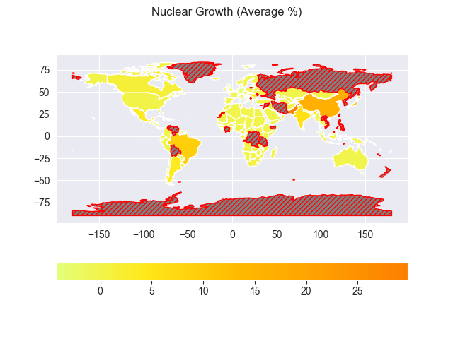
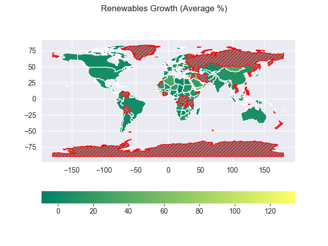

# Sustainable Energy Analysis
This data analysis project focuses on exploring and analyzing the "Global Data on Sustainable Energy (2000-2020)"
dataset, created by Ansh Tanwar and obtained from kaggle.com. 
The Juypter notebook "SustainableEnergyEDA.ipynb" contains my analysis of this dataset, 
my thoughts while exploring it, and some visualizations I created to gain insights into sustainable energy trends over two dacades.

## Steps Taken to Perform Exploratory Data Analysis (EDA)
- Renamed columns for consistency.
- Adjusted data types.
- Checked for duplicates (none found).
- Detected and visualized outliers.
- Explored different strategies for handling NaN values.
- Engineered new data columns based on existing data.

- Generated various data visualizations including:
  - Heatmaps and Pairplots to visualize correlations between variables
  - Choropleth Maps of geographic trends, using vector and raster map data from Natural Earth.

## Geography Data
This was my first experience using GeoPandas to create geographic data visualizations.
Natural Earth provides free vector and raster map data, 
and GeoPandas makes it easy to merge dataframes based on geographic data. 
This eliminated the need to merge the dataframes based on contradicting country names.

    
    
    

<!--
![Choropleth map of Fossil Fuel Growth][fossil_fuels_growth]
![Choropleth map of Nuclear Growth][nuclear_growth]
![Choropleth map of Renewables Growth][renewables_growth] -->

## Future Plans
While the current project lacks a machine learning component, I am considering expanding on it in the future.
This may involve a predictive or classification task, potentially incorporating more datasets, such as one on global health trends.

## Required Packages:
- jupyter
- pandas
- numpy
- matplotlib
- seaborn
- geopandas

## Datasets Used:
[Global Data on Sustainable Energy (2000-2020)](https://www.kaggle.com/datasets/anshtanwar/global-data-on-sustainable-energy)
is hosted on kaggle.com with an [Attribution 4.0 International (CC BY 4.0)](https://creativecommons.org/licenses/by/4.0/legalcode) license.
The file 'global-data-on-sustainable-energy.csv' is unchanged.

[Natural Earth: 'Admin 0 - Countries'](https://www.naturalearthdata.com/downloads/110m-cultural-vectors/110m-admin-0-countries/)
is hosted on naturalearthdata.com. I used the map data to create some data visualizations.

[fossil_fuels_growth]: images/Fossil_Fuels_Growth.png
[nuclear_growth]: images/Nuclear_Growth.png
[renewables_growth]: images/Renewables_Growth.png